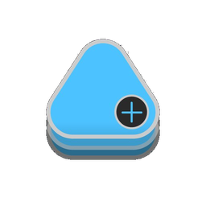
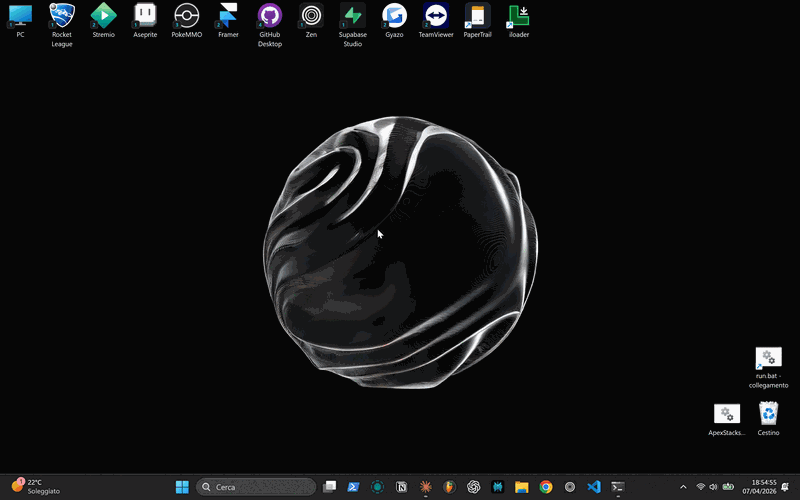

<div align="center">
  
  <h1>ApexStacks</h1>
  <p><strong>Icon stacks for your Windows desktop — inspired by Apex Launcher on Android</strong></p>
  <p>
    <a href="https://github.com/oshaw8t-dev/ApexStack/releases/latest"></a>
    
    
  </p>
</div>

---

> **Beta** — works well for daily use, but edge cases exist. [Report bugs here](https://github.com/oshaw8t-dev/ApexStack/issues).

## What is ApexStacks?

ApexStacks lets you group multiple apps, files, and folders behind a single desktop icon.
Hold the icon → it fans out into its sub-apps. Click one to launch it.

No more cluttered desktop. No taskbar bloat. Just your desktop, organized.



## Quick start

1. Download `ApexStacks_Setup_v0.1.0.exe` from the [latest release](https://github.com/oshaw8t-dev/ApexStack/releases/latest)
2. Run the installer (Windows 10 / 11, no extra dependencies)
3. ApexStacks starts in the system tray

## How to use

| Action | Result |
|--------|--------|
| **Long press** on a stack icon (~700ms) | Fan-out animation — sub-apps appear |
| **Click** a sub-app | Launch it |
| **Alt+Click** on any desktop icon | Enter edit mode |
| **Drag** one desktop icon **onto another** | Create a stack automatically |
| **Ctrl+Click** multiple icons + drag onto a stack | Add multiple apps at once |
| **Drag a sub-app off the stack** | Remove it and restore to desktop |

## Features

- Animated fan-out (N / S / E / W, auto-inverts near screen edges)
- **Drag-to-create** — drop any icon onto another to instantly form a stack
- **Multi-drag** — Ctrl+Click or rectangle-select multiple icons, drag them all in at once
- **Edit mode** — add, remove, reorder, rename, change icon of sub-apps
- **Desktop archive** — files added from the desktop move to `storage/` automatically; desktop stays clean
- **Drag back to desktop** — drag a sub-app out to restore the file and remove it from the stack
- Right-click context menu on sub-apps (rename, change icon, replace, open path)
- Configurable archive folder and archive mode (auto / ask / manual)
- Multi-monitor support (including non-primary monitors, mixed DPI)
- Windows startup toggle (via system tray)
- Automatic backup of `stacks.json` (last 3 versions)
- Debug log viewer accessible from the tray
- Fully painted UI — no native windows, no taskbar presence

## Known limitations

- Drag-to-create does not work with raw `.exe` icons on the desktop (Windows OLE Shell intercepts the drag). Use `.lnk` shortcuts instead, or add apps manually via Alt+Click → edit mode.

## Running from source

```bash
pip install PyQt6
python ApexStacks.py
```

Or use `run.bat` for a development console.

## Building the exe

```bash
pip install pyinstaller
pyinstaller ApexStacks.spec --clean
```

Output: `dist/ApexStacks.exe`

## Configuration

Settings and stack data are stored in `%APPDATA%\ApexStacks\`. You can back up or migrate this folder between machines.

## Contributing

Bug reports and feature requests are welcome on [Issues](https://github.com/oshaw8t-dev/ApexStack/issues).
If you want to contribute code, open an issue first to discuss the change.

## License

MIT — see [LICENSE](LICENSE)

## Author

Osha <3
